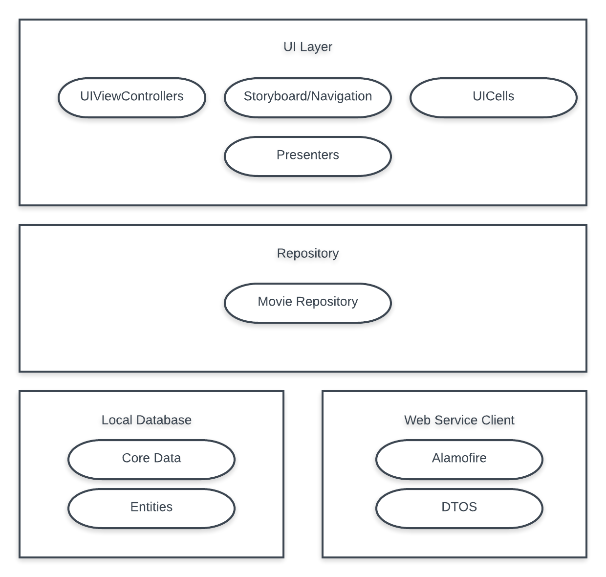

# movie-ios-app

An app example to showcase the interaction between pod dependencies following the SOLID software design principles.

* Layers diagram:

  * Each layer has it's own module which handles different kinds of responsibility. 
  * UI Layer: handles all visual presentation. from showing the collection view of the movies. to the details and the local search engine built into the app, this also involves the Presenters which is fundamental part of how all the data is requested to the repository.
  
    ### Views: 
    - MoviesViewController
    - MovieDetailsViewController
    - SearchMoviesViewController
    
    ### Presenters:
    - MoviesPresenter
    - MovieDetailsPresenter
    - SearchMoviesPresenter
    
  * Repository: This layer leverages all functionality exposed by the lower layers such as the Web Service Client and the Local Database in order to retrieve data from the remote api and then store it locally. through this layer is that the UI will be fed with all the data needed to be displayed to the user.
  
  
  

## Dependencies:
  
  All dependencies are tied together through a small protocol-oriented dependency injector. located on the DI folder/Group of the main MoviesApp project. This help us to inject fresh inmmutable dendencies to the presenters and repository instances.
  
## How to run the app:

  Easy, just download this repository, and then run _pod install_ on a command line terminal. then you should be able to open the workcpace of the project an run in on a Device or Simulator.
  
  
## Considerations:
  
  - This app is optimized for ipads.
  - Error handling is not being considered that much.
  - Supports default swift 4.0
